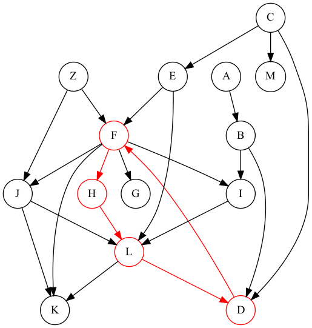

# Directed Acyclic Graph Cycle Check Utility

## Instructions

Please write a command line utility that takes in a graph from standard input (in the format described below) and looks for cycles in that graph.

The utility should output (to standard output) an arbitrary cycle (if one exists, nothing otherwise).

The utility’s exit code should be
0 if no cycle was found,
1 if a cycle was found,
2 if the input is invalid.

The input will be given as a series of edges with tab delimited lines (each line separated by a single newline \n).

An edge should have exactly two fields, each referring to a node’s unique identifier, interpreted as a directed from the first node to the second.

Node identifiers may contain any character besides tabs and newlines, but they should have at least a single character.

If a cycle is found, the output should be given as a series of node identifiers separated by newlines (the first node should not be repeated).

If there are multiple cycles, only one should be returned (the choice of which may be arbitrary). For example, if the given graph has a cycle from A to B to A, the output could be A\nB\n.

---

## Notes
- Use `echo $?` to get the exit code of the process in `sh`
- A BTreeMap would be helpful for solving this problem - once https://github.com/rust-lang/rust/issues/62924 lands

